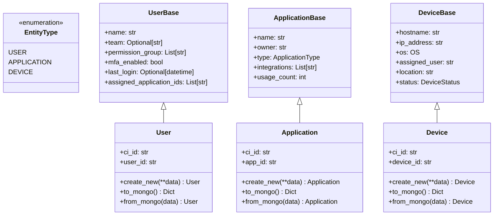
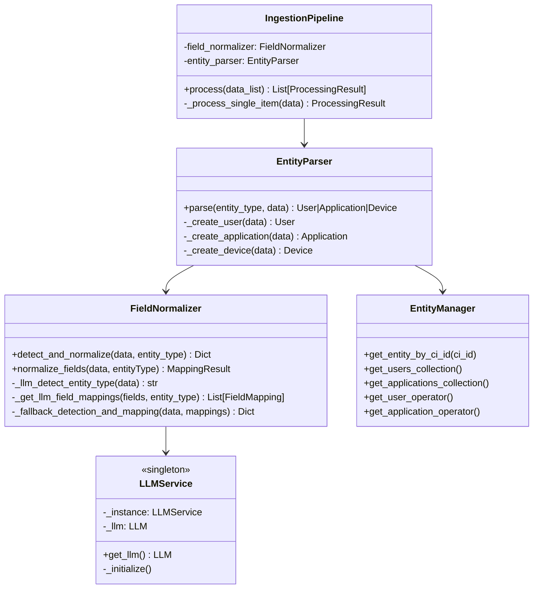
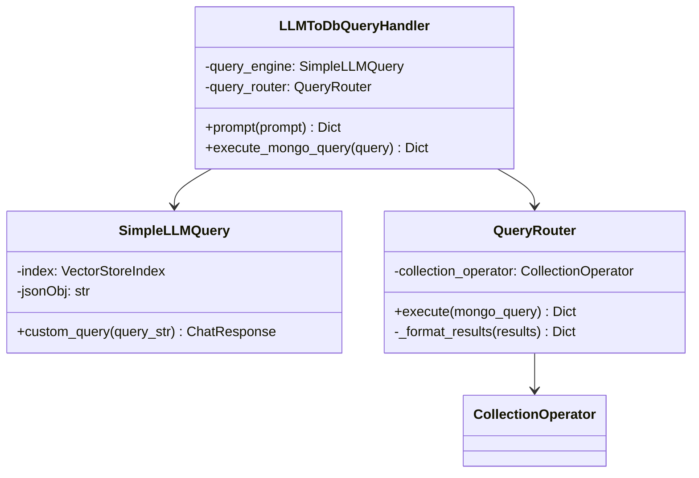

# CMDB Service

A Configuration Management Database (CMDB) service built with FastAPI that provides entity management and AI-powered natural language querying capabilities.

## Architecture Overview

The CMDB service is designed with a modular architecture that supports multiple database backends, AI-enhanced field mapping, and natural language query processing.

### Entity Models



### Data Processing Pipeline



### Query Engine




## Assumptions & Limitations
- For this implementation, the data extraction and normalization are done in process synchronously. Though the data pipeline would be a perfect use case for streaming pipeline
- All data are immutable, no update and delete are allowed
    - this is mostly for simplicity purposes. But also to not spend too much time in the developing queries revision for MongoDB.
    - if Update is needed, then it will be done as part of the ingestion, and we would need to store the origination id (right now omitted after normalization) to compare the data.
- The ci_id is normalized throughout collections, no information of the CI entity type is exposed from the id.
- Assumptions on Dependency Mappings
- The natural language prompt can only work on a single collection at a time

## API Endpoints

### Data Endpoints
- `GET /api/v1/data/ci/{ci_id}` - Get entity by CI ID
- `GET /api/v1/data/users` - List all users (with pagination)
- `GET /api/v1/data/apps` - List all applications (with pagination)

### Ingestion Endpoints
- `POST /api/v1/ingest/` - Process and ingest entity data

### Query Endpoints
- `POST /ask/` - Natural language query interface

## Configuration

The service uses Pydantic settings for configuration:

```python
class Settings(BaseSettings):
    app_name: str = "CMDB Service"
    app_version: str = "1.0.0"
    debug: bool = False

    # Database configuration
    database_type: str = "mongodb"  # Options: "mongodb", "memory"
    mongodb_url: str = "..."
    database_name: str = "cmdb_shm"

    # AI configuration
    openai_api_key: str = "..."
    enable_ai_field_mapping: bool = True
```

## Schema Management

The service includes automatic schema generation and updates:

- **Field Mapping Schema**: Defines canonical fields and variations for AI mapping
- **Enhanced DB Schema**: Provides LLM context for query generation
- **Auto-Update Script**: `update_schemas.py` synchronizes schemas with model changes

## Installation and Setup

1. Install dependencies:
```bash
pip install -r requirements.txt
```

2. Configure environment variables or `.env` file:
```bash
MONGODB_URL=your_mongodb_connection_string
OPENAI_API_KEY=your_openai_api_key
DATABASE_TYPE=mongodb  # or "memory" for testing
```

3. Run the service:
```bash
python run.py
```

## Usage Examples

### Ingesting Data
```bash
curl -X POST "http://localhost:8000/ingest" \
     -H "Content-Type: application/json" \
       -d '{
        "data" : [ 
            {
            "user_id": "u_110",
            "name": "Jane Doe",
            "email": "jane.d@example.com",
            "permissions": ["Engineering", "Admins"],
            "apps": ["GitHub", "Slack", "Salesforce"],
            "mfa_enabled": true,
            "last_login": "2024-07-15T10:03:00Z",
            "status": "ACTIVE"
            }, 
            {
            "user_id": "u_123",
            "name": "Alice Wonder",
            "email": "alice.w@example.com",
            "permissions": ["Sales", "Team Leads"],
            "apps": ["Salesforce"],
            "mfa_enabled": false,
            "last_login": "2025-09-15T09:03:00Z",
            "status": "ACTIVE"
            }, 
            {
            "user_id": "u_456",
            "name": "Bob Brown",
            "email": "bob.b@example.com",
            "permissions": ["Sales", "Admins"],
            "apps": ["Salesforce", "Slack", "Okta"],
            "mfa_enabled": false,
            "last_login": "2023-09-15T09:03:00Z",
            "status": "INACTIVE"
            }]
}'
```
```bash
{
    "results":
        [
            {"ci_id":"CI-1A912B49113E","entity_type":"user","message":"User created successfully","timestamp":"2025-09-28T21:15:18.539483Z"},
            {"ci_id":"CI-F336212E1CDC","entity_type":"user","message":"User created successfully","timestamp":"2025-09-28T21:15:18.539483Z"},
            {"ci_id":"CI-31E90886B61A","entity_type":"user","message":"User created successfully","timestamp":"2025-09-28T21:15:18.539483Z"}
        ]
}
```
Create Application mixed with Users, Utilize LLM to detect and normalize the fields

```bash
curl -X POST "http://localhost:8000/ingest" \
     -H "Content-Type: application/json" \
       -d '{
        "data" : [ 
      {
            "user_id": "u_789",
            "name": "Rob Oppenheimer",
            "email": "rob.op@example.com",
            "permissions": ["Engineering", "CTO"],
            "apps": ["Github", "Slack", "Lab"],
            "mfa_enabled": true,
            "last_login": "1954-09-15T09:03:00Z",
            "status": "INACTIVE"
     },
    {
       "application_name" : "GitHub",
       "Owner" : "FooBar",
       "type" :  "SaaS",
       "integration" : ["Billing", "Slack"],
       "usageCount" : 1234
    }]
}'

```

```bash
{
    "results":
    [
        {"ci_id":"CI-0302FC7292D2","entity_type":"user","message":"User created successfully","timestamp":"2025-09-28T21:42:03.733648Z"},
        {"ci_id":"CI-B322539522C3","entity_type":"application","message":"Application created successfully","timestamp":"2025-09-28T21:42:03.733648Z"}
    ]
}
```

### Natural Language Queries
```bash
curl -X POST \
    -H "Content-Type: application/json" \
    -d '{"prompt": "Find all users with mfa disabled"}' \
    http://localhost:8000/ask
```
```bash
{
    "original_prompt":"Find all users with mfa disabled",
    "mongo_query":{"collection":"users","query":{"mfa_enabled":false}},
    "execution":
    {
        "collection":"users",
        "query":{"collection":"users","query":{"mfa_enabled":false}},
        "count":2,
        "results":
        [
            {"name":"Alice Wonder","team":null,"permission_group":["Sales","Team Leads"],"mfa_enabled":false,"last_login":"2025-09-15T09:03:00","assigned_application_ids":["Salesforce"],"ci_id":"CI-F336212E1CDC","user_id":"USR-F61B01DD1C0A"},
            {"name":"Bob Brown","team":null,"permission_group":["Sales","Admins"],"mfa_enabled":false,"last_login":"2023-09-15T09:03:00","assigned_application_ids":["Salesforce","Slack","Okta"],"ci_id":"CI-31E90886B61A","user_id":"USR-3F2FBC5B2B70"}
        ]
    }
}
```

```bash
  curl -X POST \
    -H "Content-Type: application/json" \
    -d '{"prompt": "Show applications with no users"}' \
    http://localhost:8000/ask
```

```bash
{
    "original_prompt":"Show applications with no users",
    "mongo_query":{"collection":"applications","query":{"user_ids":{"$size":0}}},
    "execution":
    {"
        collection":"applications",
        "query":{"collection":"applications",
        "query":{"user_ids":{"$size":0}}},
        "count":0,
        "results":[]
    }
}
```

### List Data
```bash
curl -X GET "http://localhost:8000/apps"
```
```bash
[
    {"name":"GitHub","owner":"FooBar","type":"SaaS","integrations":["Billing","Slack"],"usage_count":1234,"ci_id":"CI-029CB6E8B752","app_id":"APP-4A81F0B58003"}
]
```

```bash
curl -X GET "http://localhost:8000/ci/CI-0302FC7292D2"
```

```bash
{
    "entity_type":"user",
    "entity_data":
    {
        "name":"Rob Oppenheimer",
        "team":null,
        "permission_group":["Engineering","CTO"],
        "mfa_enabled":true,
        "last_login":"1954-09-15T09:03:00",
        "assigned_application_ids":["Github","Slack","Lab"],
        "ci_id":"CI-0302FC7292D2",
        "user_id":"USR-DFFE42ED0349"
    }
}
```

### Listing Entities
```bash
# Get all users
curl "http://localhost:8000/api/v1/data/users?skip=0&limit=50"

# Get all applications
curl "http://localhost:8000/api/v1/data/apps?skip=0&limit=50"
```

## Project Structure

```
cmdbSvc/
├── app/
│   ├── api/
│   │   └── endpoints/
│   │       ├── ingest.py          # Data ingestion endpoint
│   │       └── data.py            # Data retrieval endpoints
│   ├── core/
│   │   ├── ingest/
│   │   │   ├── ingestion_pipeline.py # Main ingestion pipeline
│   │   │   ├── field_normalizer.py   # AI field mapping
│   │   │   └── entity_parser.py      # Entity creation
│   │   ├── prompt/
│   │   │   ├── llm_query_handler.py  # Natural language queries
│   │   │   └── query_router.py       # Query execution
│   │   ├── llm_data/
│   │   │   ├── db_enhanced_schema.py  # LLM schema context
│   │   │   └── field_mapping_schema.py # Field mapping definitions
│   │   ├── entity_data/
│   │   │   └── entity_manager.py     # Entity operations
│   │   ├── llm_service.py            # Singleton LLM service
│   │   └── schemas.py                # Pydantic models
│   ├── db/
│   │   ├── connection.py             # Database abstraction
│   │   ├── models.py                 # Entity models
│   │   └── repositories/             # Data access layer
│   ├── config/
│   │   └── settings.py               # Configuration
│   └── main.py                       # FastAPI application
├── update_schemas.py                 # Schema update utility
├── run.py                           # Application runner
├── requirements.txt                 # Dependencies
└── README.md                        # This file
```

## Dependencies

- **FastAPI**: Web framework
- **Pydantic**: Data validation and settings
- **Motor**: Async MongoDB driver
- **LlamaIndex**: LLM integration framework
- **OpenAI**: AI model access

This CMDB service provides a robust, scalable, and AI-enhanced solution for configuration management with support for natural language querying and intelligent data processing.